# 🚀 Learn Kafka – Phase 1  
**Environment:** Confluent Platform 7.9.x  di Local VM(VirtualBox)
**Mode:** 1 ZooKeeper, 1 Kafka Broker, 1 Schema Registry, 1 Kafka Connect, 1 ksqlDB, 1 Kafka REST Proxy, 1 Control Center
**Specs:** 4-Core CPU, 10GB RAM, 40GB Disk
---

## 2.1 Install Confluent Platform via Package Manager

Pada tahap ini saya melakukan persiapan environment sebelum instalasi Confluent Platform.

### 🔹 Update & Download Java
Langkah pertama adalah memastikan Java telah terinstall karena seluruh service Confluent berjalan di atas JVM.

---

### 🔹 Verifikasi Java
Setelah instalasi Java, saya melakukan pengecekan versi untuk memastikan Java aktif dan dikenali sistem.

---

### 🔹 Menambahkan Repository Confluent
Saya menambahkan repository Confluent agar package Confluent Platform dapat di-install melalui package manager.

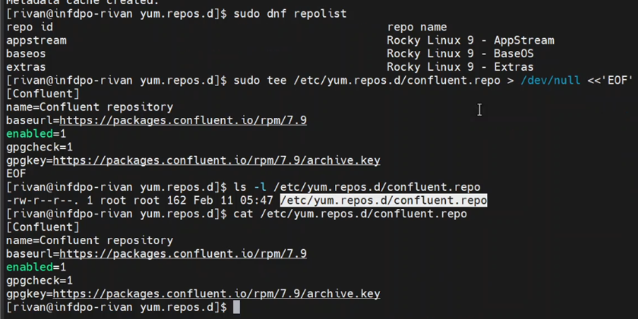

---

### 🔹 Verifikasi Repository
Memastikan repository Confluent berhasil ditambahkan dan dapat diakses.

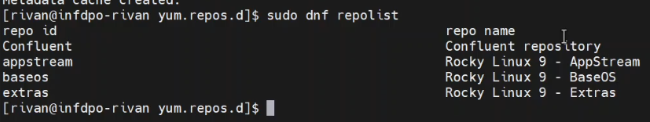

---

### 🔹 Download Package Confluent Platform
Melakukan download seluruh komponen Confluent Platform.

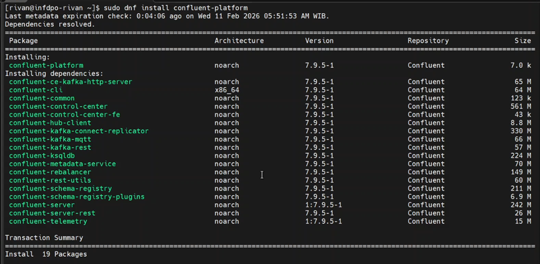

---

### 🔹 Install Confluent Platform
Melakukan instalasi service-service utama:

- ZooKeeper  
- Kafka Broker  
- Schema Registry  
- Kafka Connect  
- ksqlDB  
- Kafka REST Proxy  
- Control Center  

---

### 🔹 Verifikasi Instalasi
Memastikan seluruh package berhasil terpasang tanpa error.

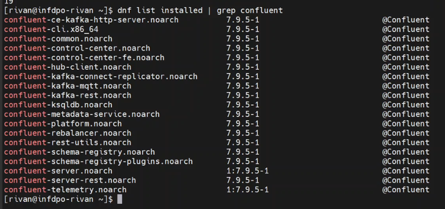

---

## 2.2 Deploy Kafka Cluster menggunakan systemd

Pada tahap ini saya menjalankan service Confluent Platform menggunakan `systemd`.

Hal ini memungkinkan service berjalan sebagai daemon dan otomatis start saat boot.

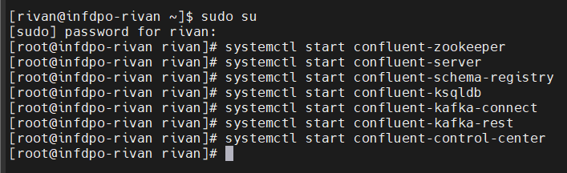

---

## 2.3 Verifikasi Seluruh Service Confluent Platform

Saya melakukan pengecekan status setiap service untuk memastikan cluster berjalan normal.

---

### 🔹 ZooKeeper
Memastikan ZooKeeper aktif sebagai metadata coordinator Kafka cluster.

---

### 🔹 Kafka Broker
Verifikasi Kafka broker berjalan dan listening pada port 9092.

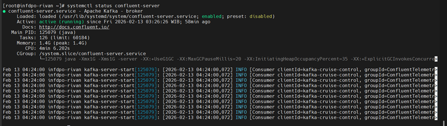

---

### 🔹 Schema Registry
Memastikan Schema Registry aktif untuk kebutuhan Avro / Protobuf / JSON Schema.

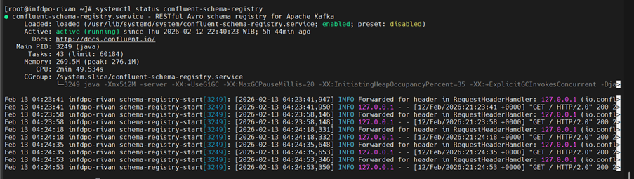

---

### 🔹 ksqlDB
Verifikasi ksqlDB server berjalan untuk stream processing.

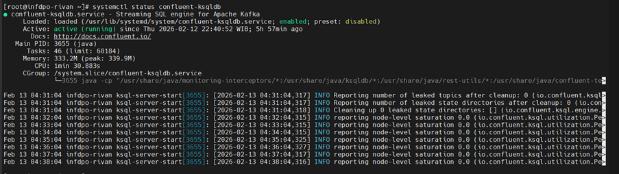

---

### 🔹 Kafka Connect
Memastikan Kafka Connect berjalan untuk integrasi source/sink connector.

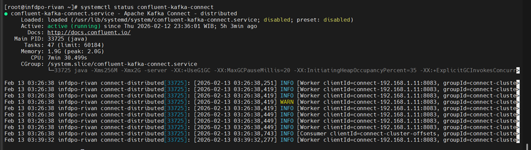

---

### 🔹 Kafka REST Proxy
Verifikasi REST Proxy aktif untuk akses Kafka via HTTP API.

---

### 🔹 Confluent Control Center
Memastikan UI monitoring cluster berjalan.

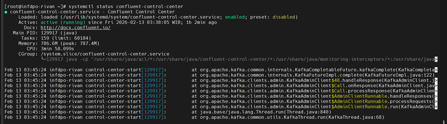

---

## 2.4 Membuat Topic & Test Produce/Consume

Tahap ini bertujuan memastikan Kafka cluster benar-benar berfungsi.

---

### 🔹 Create Topic
Membuat topic baru untuk testing.

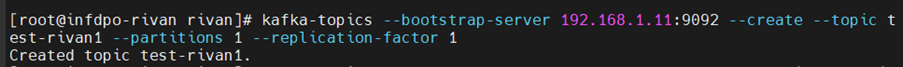

---

### 🔹 Describe Topic
Memastikan topic berhasil dibuat dan memiliki partition & leader.

---

### 🔹 Test Produce
Mengirim data ke topic menggunakan CLI producer.

---

### 🔹 Test Consume
Membaca data dari topic menggunakan CLI consumer.

---

## 2.5 Pengecekan ZooKeeper & Kafka Cluster

---

### 🔹 ZooKeeper Quorum
Memastikan ZooKeeper node aktif dan terhubung.

---

### 🔹 Kafka Cluster ID
Memverifikasi cluster ID dari broker metadata.

---

## 2.6 Summary

Pada Phase 1 ini saya berhasil:

✅ Menginstall dan Konfigurasi Confluent Platform 7.9.x  
✅ Menjalankan seluruh service utama  
✅ Memverifikasi health service  
✅ Membuat topic Kafka  
✅ Melakukan test produce & consume  
✅ Memverifikasi ZooKeeper & Cluster ID  

Sebagai validasi akhir, saya memastikan Confluent Control Center dapat diakses melalui browser.

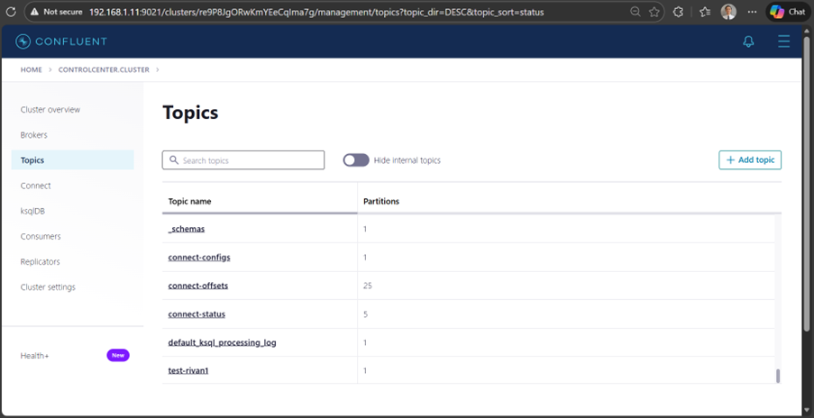
