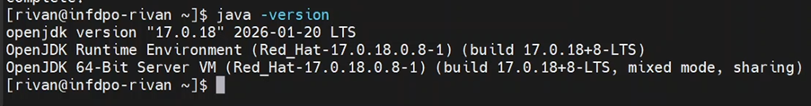
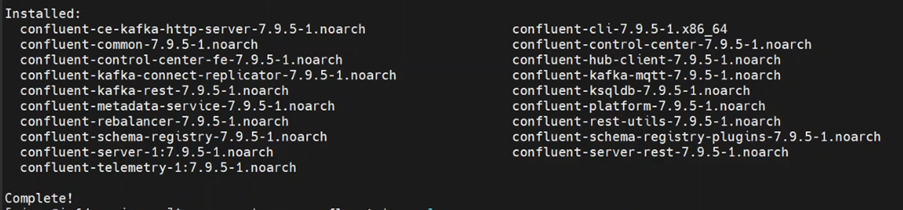
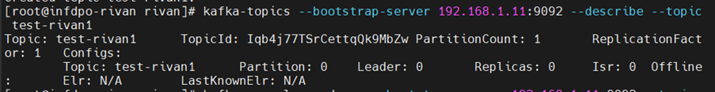
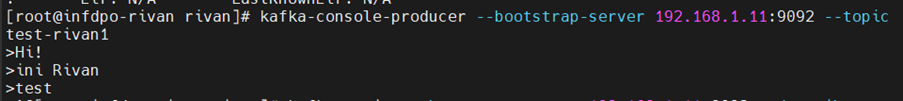
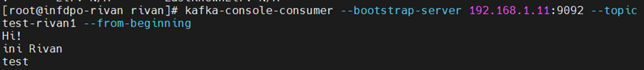
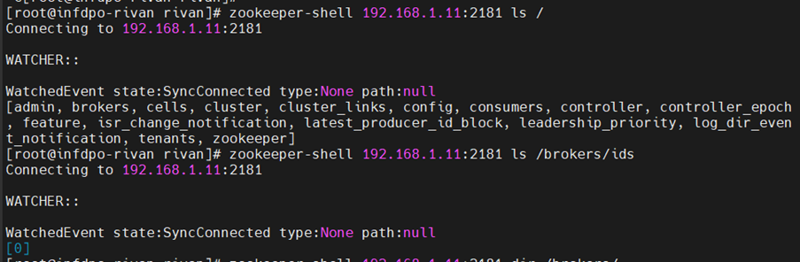
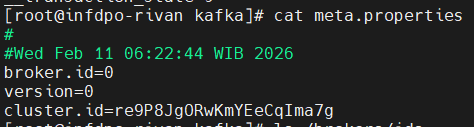

2.1 Install CP via Package Manager with all services (zookeeper, kafka, schema registry, kafka connect, ksqldb, kafka rest, Control center)

2.2 Deploy kafka cluster menggunakan systemd

2.3 Pastikan Control Center dan seluruh service terdeteksi
Zookeeper

Broker

Schema Registry

KsqlDB

Kafka Connect

Kafka REST

Confluent Control Center

2.4 Buat topic, test produce data dan consume data menggunakan CLI

 
 
 
2.5 Lakukan pengecekan zookeeper quorum dan kafka cluster id
 

 

2.6 Write summary/documentation for all of the activity above.

 

