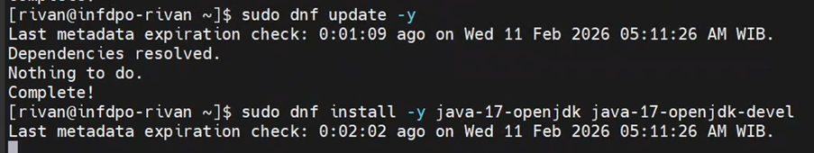

## 2.1 Install CP via Package Manager with all services
(zookeeper, kafka, schema registry, kafka connect, ksqldb, kafka rest, Control Center)

---

## 2.2 Deploy Kafka Cluster menggunakan systemd

---

## 2.3 Pastikan Control Center dan seluruh service terdeteksi

### Zookeeper

### Broker

### Schema Registry

### KsqlDB

### Kafka Connect

### Kafka REST

### Confluent Control Center

---

## 2.4 Buat topic, test produce data dan consume data menggunakan CLI

---

## 2.5 Lakukan pengecekan Zookeeper quorum dan Kafka Cluster ID

---

## 2.6 Write summary/documentation for all of the activity above

