# 🚀 Learn Kafka – Rivan Phase 2.1

## 🎯 Objective
Pada phase ini saya melakukan eksplorasi fitur lanjutan di Confluent Platform:

- Menggunakan **Avro Producer & Consumer**
- Membuat **Source & Sink Connector (Kafka Connect)**
- Melakukan **Stream Processing dengan ksqlDB**
- Mendokumentasikan hasil pengujian

---

# 🧩 2.1 Avro Producer & Consumer

## ✅ Producer (Avro)

Pada tahap ini saya mengirim data ke Kafka menggunakan **kafka-avro-console-producer**.

Langkah yang terjadi:

1️⃣ JSON dibaca oleh producer  
2️⃣ KafkaAvroSerializer aktif  
3️⃣ JSON dikonversi menjadi **Avro binary**  
4️⃣ Schema otomatis diregister ke **Schema Registry**  
5️⃣ Message dikirim ke topic **avro-test**

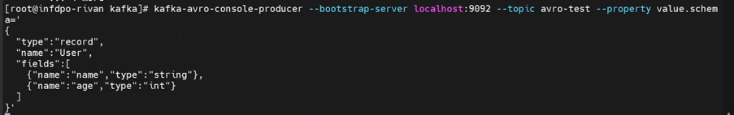
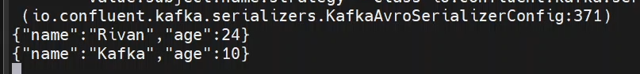

---

## ✅ Consumer (Avro)

Kemudian saya membaca data menggunakan **kafka-avro-console-consumer**.

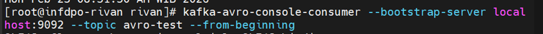

Proses yang terjadi:

1️⃣ Consumer mengambil Avro binary dari broker  
2️⃣ KafkaAvroDeserializer aktif  
3️⃣ Consumer mengambil schema dari Schema Registry  
4️⃣ Avro dikonversi kembali menjadi JSON  
5️⃣ Data ditampilkan ke console

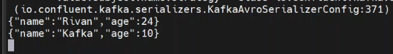

---

# 🔌 2.1 Kafka Connect – Source & Sink Connector

## ✅ Membuat Topic untuk Datagen

Saya membuat topic baru sebagai target data generator.

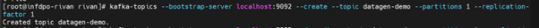

---

## ✅ Verifikasi Topic

Memastikan topic berhasil dibuat.

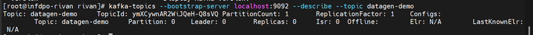

---

## ✅ Membuat Source Connector (Datagen)

Menggunakan **DatagenConnector** untuk menghasilkan data dummy secara realtime.

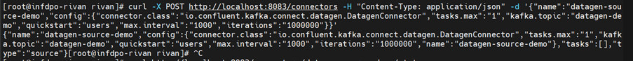

---

## ✅ Cek Status Connector

Memastikan connector berjalan normal.

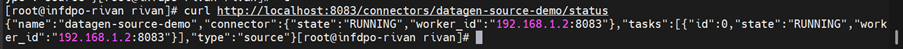

---

## ✅ Verifikasi Data di Topic

Mengecek apakah data berhasil masuk ke Kafka topic.

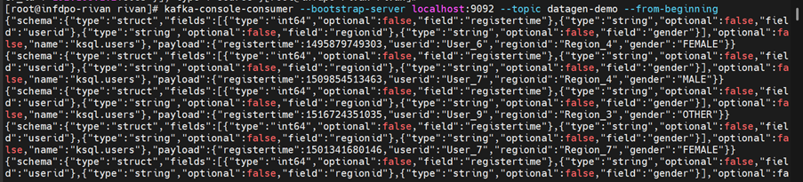
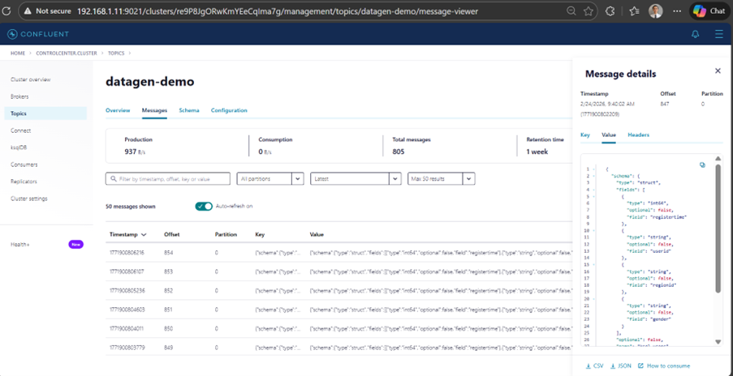

---

# 🛢️ Sink Connector – JDBC ke PostgreSQL

## ✅ Install JDBC Connector

Menginstall plugin JDBC Sink Connector.

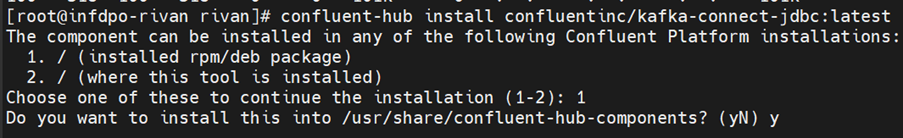

---

## ✅ Verifikasi Plugin JDBC

Memastikan JDBC connector terdeteksi.

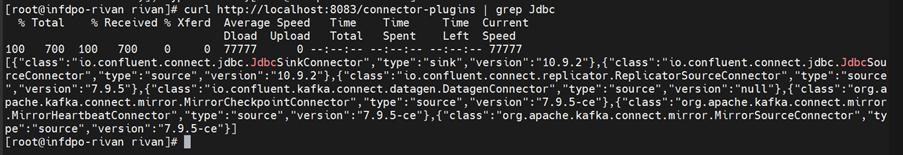

---

## ✅ Membuat JDBC Sink Connector

Mengirim data dari topic Kafka ke PostgreSQL.

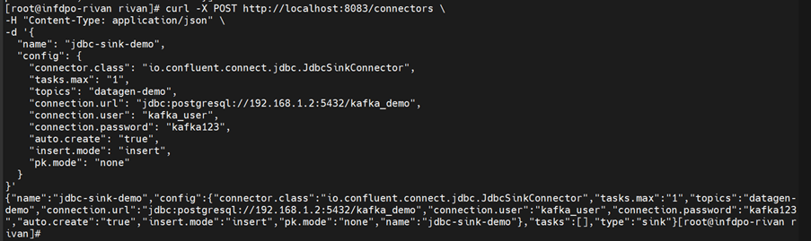

---

## ✅ Cek Status Sink Connector

Memastikan sink connector berjalan.

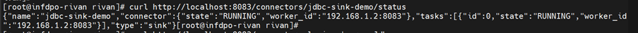

---

## ✅ Verifikasi Data di PostgreSQL

Memastikan data berhasil landing ke database.

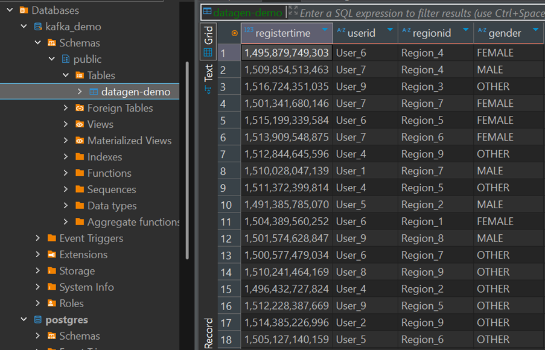

---

# 🌊 2.1 Stream Processing – ksqlDB

## ✅ Masuk ke ksqlDB CLI

Mengakses CLI ksqlDB.

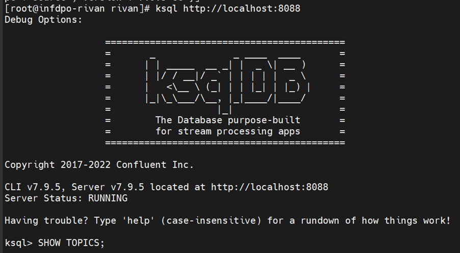

---

## ✅ Cek Topic yang Ada

Melihat daftar topic Kafka.

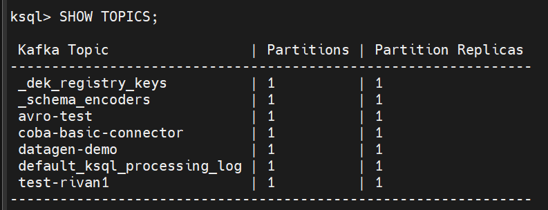

---

## ✅ Menampilkan Isi Topic

Memastikan data terbaca di ksqlDB.

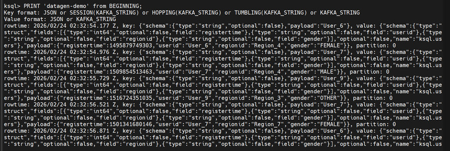

---

## ✅ Membuat Stream users_stream

Mapping struktur payload JSON ke kolom stream.

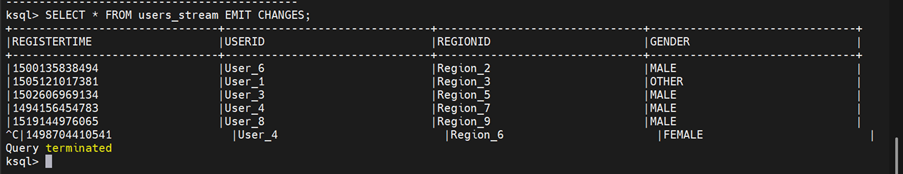

---

## ✅ Transformasi Data (Uppercase Gender)

Mengubah nilai gender menjadi uppercase.

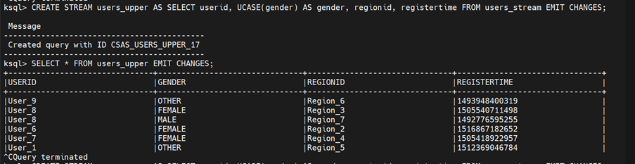

---

## ✅ Transformasi Data (Lowercase Gender)

Mengubah nilai gender menjadi lower.

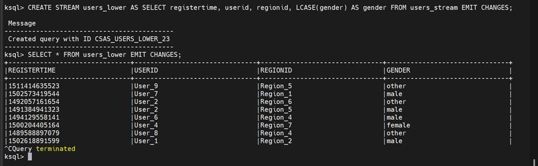

---

## ✅ Filter Stream (Female Only)

Menyaring data gender FEMALE.

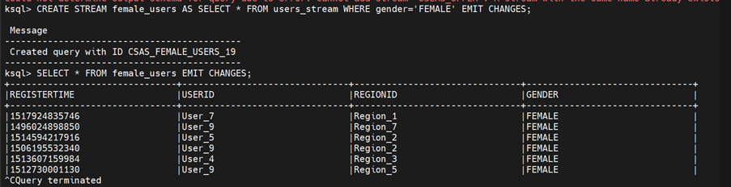

---

## ✅ Aggregation (Users per Region)

Menghitung jumlah user per region.

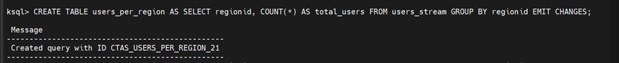
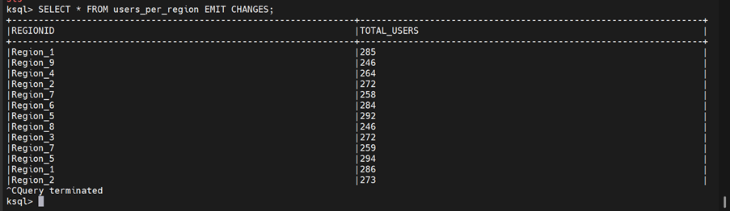

---

## ✅ Verifikasi Topic Baru

Melihat topic hasil stream processing.

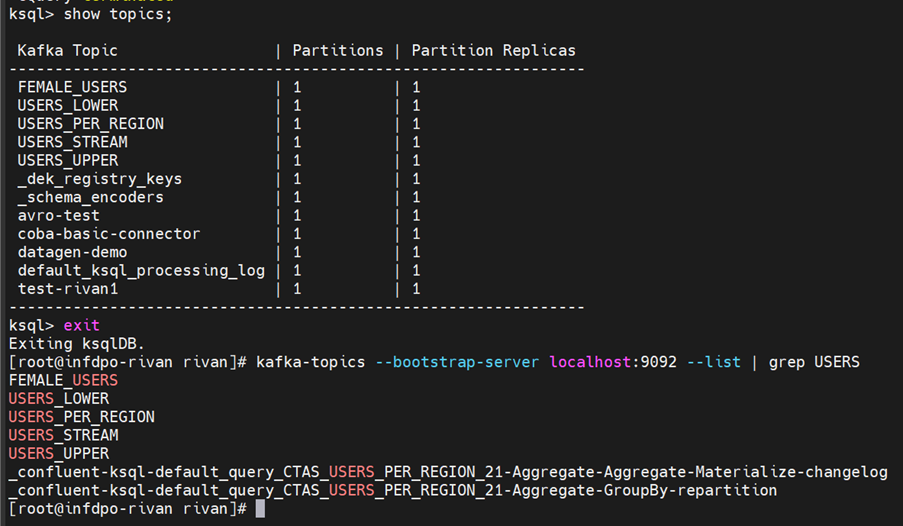

---

# 📝 Summary Phase 2.1

Pada phase ini saya berhasil:

✅ Menggunakan Avro serialization & Schema Registry  
✅ Memahami alur JSON → Avro → JSON  
✅ Menggunakan Kafka Connect (Datagen Source)  
✅ Mengirim data Kafka → PostgreSQL (JDBC Sink)  
✅ Menggunakan ksqlDB untuk:
- Stream creation
- Transformasi data
- Filtering data
- Aggregation realtime

Phase ini memperkuat pemahaman saya terhadap:

- Event Streaming  
- Schema Management  
- Data Integration  
- Stream Processing  

---

🔥 **Next Phase:** Kafka Security & Advanced Processing
