# Hands On Basic Kafka: Security

Pada phase ini saya melakukan implementasi **Kafka Security menggunakan
TLS/SSL dan ACL**.\
Tujuannya adalah untuk memastikan komunikasi antar komponen Kafka
berjalan secara **terenkripsi (encrypted) dan terautentikasi**.

Pada percobaan ini saya mencoba mengamankan beberapa komponen utama
Kafka, yaitu:

-   ZooKeeper
-   Kafka Broker
-   Kafka Client
-   Inter Broker Communication
-   Authorization menggunakan ACL

Secara sederhana alur security yang saya bangun adalah:

    Kafka Client (SSL)
            │
            ▼
    Kafka Broker :9093 (SSL)
            │
            ▼
    ZooKeeper :2281 (SSL)

------------------------------------------------------------------------

# Generate Keystore dan Certificate

Sebelum mengaktifkan TLS di Kafka dan ZooKeeper, saya perlu membuat
**certificate, keystore, dan truststore** terlebih dahulu.

Secara sederhana konsepnya adalah:

**Keystore**\
Berisi identitas service itu sendiri (private key + certificate).

**Truststore**\
Berisi daftar certificate yang dipercaya oleh service tersebut.

Dalam percobaan ini saya membuat certificate untuk:

-   Kafka Broker
-   Kafka Client
-   ZooKeeper

------------------------------------------------------------------------

## Generate Keystore untuk Kafka Broker

    keytool -genkey -alias kafka-broker -keystore kafka.server.keystore.jks -keyalg RSA -validity 365

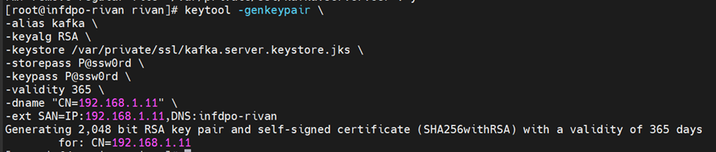

------------------------------------------------------------------------

## Export Certificate Kafka Broker

    keytool -export -alias kafka-broker -file kafka.server.cert -keystore kafka.server.keystore.jks

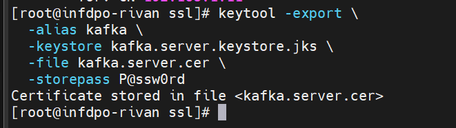

------------------------------------------------------------------------

## Import Certificate ke Truststore

    keytool -import -alias kafka-broker -file kafka.server.cert -keystore kafka.server.truststore.jks

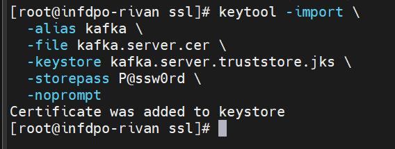

------------------------------------------------------------------------

## Generate Keystore untuk Kafka Client

    keytool -genkey -alias kafka-client -keystore kafka.client.keystore.jks -keyalg RSA -validity 365

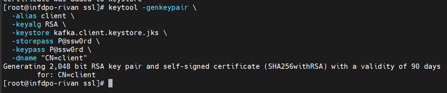

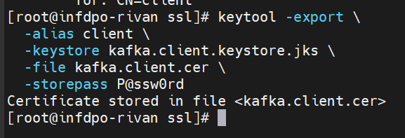

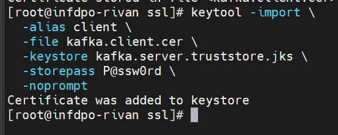

------------------------------------------------------------------------

## Generate Keystore untuk ZooKeeper

    keytool -genkey -alias zookeeper -keystore zookeeper.keystore.jks -keyalg RSA -validity 365

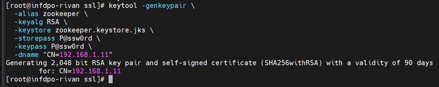

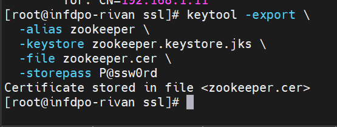

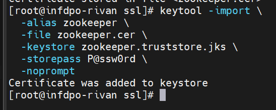

------------------------------------------------------------------------

# 4.1 Apply security for zookeeper quorum (Encryption and authentication)

Pada environment yang saya gunakan saat percobaan ini, saya hanya
menggunakan **1 Kafka broker dan 1 ZooKeeper**, sehingga sebenarnya
belum membentuk **ZooKeeper quorum cluster**.

Saya mencoba mengaktifkan TLS pada ZooKeeper.

    secureClientPort=2281

ZooKeeper default port:

    2181

ZooKeeper TLS port:

    2281

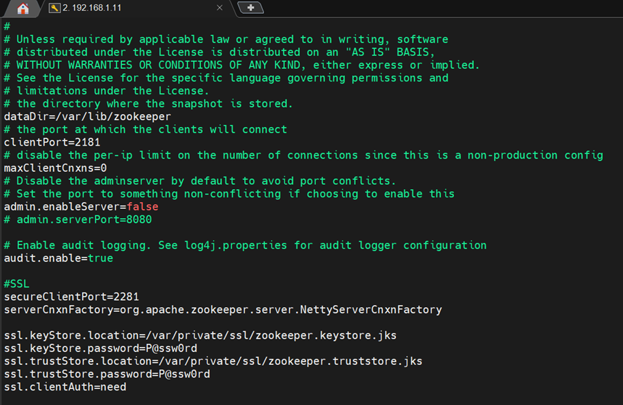

------------------------------------------------------------------------

# 4.2 Apply security for zookeeper client and connect kafka to zookeeper using security

Konfigurasi Kafka agar terhubung ke ZooKeeper menggunakan TLS.

    zookeeper.connect=localhost:2281
    zookeeper.ssl.client.enable=true

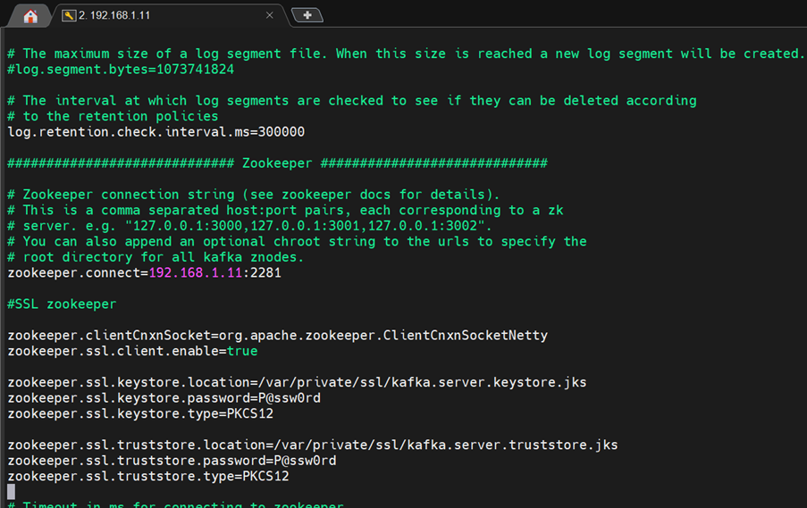

------------------------------------------------------------------------

# 4.3 Apply security for kafka inter broker

Pada percobaan ini saya hanya menggunakan **1 broker**, jadi inter
broker communication belum benar‑benar terjadi.

Namun saya tetap mengaktifkan SSL pada broker.

    listeners=SSL://:9093
    security.inter.broker.protocol=SSL

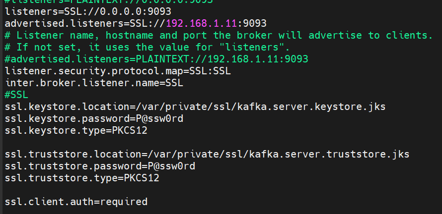

------------------------------------------------------------------------

# 4.4 Apply security for kafka client

Saya membuat file konfigurasi client:

    client-ssl.properties

    security.protocol=SSL
    ssl.truststore.location=/etc/kafka/secrets/kafka.client.truststore.jks
    ssl.keystore.location=/etc/kafka/secrets/kafka.client.keystore.jks

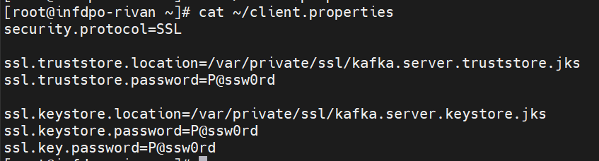

Test koneksi:

    kafka-topics.sh --bootstrap-server localhost:9093 --command-config client-ssl.properties --list

------------------------------------------------------------------------

# 4.5 Enable ACL

Mengaktifkan ACL pada Kafka.

    authorizer.class.name=kafka.security.authorizer.AclAuthorizer
    super.users=User:CN=192.168.1.11

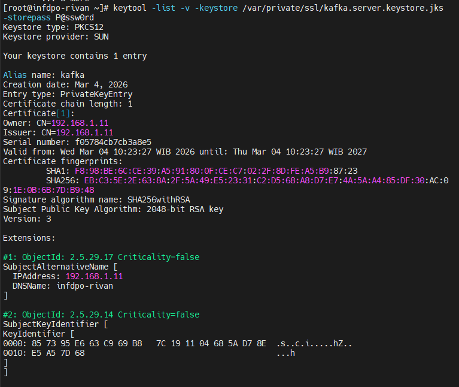

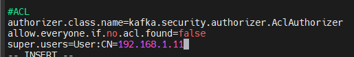

Coba menambahkan ACL Write dan Read

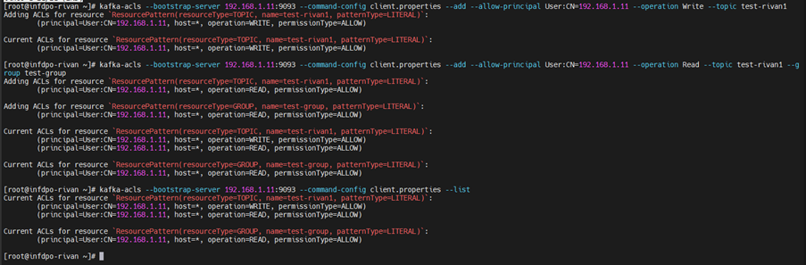

------------------------------------------------------------------------

# 4.6 Test produce and consume using security

Test producer:

    kafka-console-producer.sh --broker-list localhost:9093 --topic test-topic --producer.config client-ssl.properties

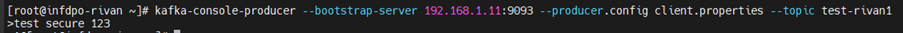

Test consumer:

    kafka-console-consumer.sh --bootstrap-server localhost:9093 --topic test-topic --from-beginning --consumer.config client-ssl.properties

------------------------------------------------------------------------

# 4.7 Summary

Dari percobaan ini saya belajar:

-   generate certificate Kafka
-   membuat keystore dan truststore
-   mengaktifkan TLS pada ZooKeeper
-   mengaktifkan TLS pada Kafka Broker
-   menghubungkan client menggunakan SSL
-   mengatur akses menggunakan ACL

Dengan konfigurasi ini komunikasi **Client → Kafka → ZooKeeper** sudah
berjalan menggunakan **TLS encryption**.
